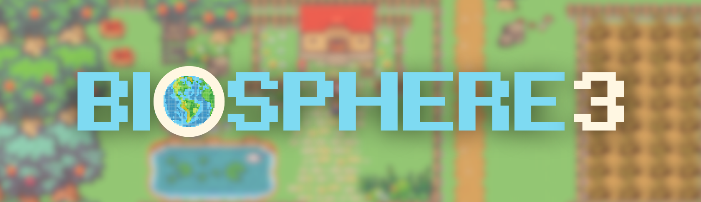

<p align="center">

<br>
<em>Biosphere3</em>
<br><br>
<a title="Build Status" target="_blank" href="#"></a>
<a title="Releases" target="_blank" href="#"></a>
<a title="Downloads" target="_blank" href="#"></a>

<br>
<a title="Docker Pulls" target="_blank" href="#"></a>
<a title="Docker Image Size" target="_blank" href="#"></a>
<a title="Hits" target="_blank" href="#"></a>
<br>
<a title="AGPLv3" target="_blank" href="#"></a>
<a title="Code Size" target="_blank" href="#"></a>
<a title="GitHub Pull Requests" target="_blank" href="#"></a>
<br>
<a title="GitHub Commits" target="_blank" href="#"></a>
<a title="Last Commit" target="_blank" href="#"></a>
<br><br>
</p>

---

## Table of Contents

* [👾 Introduction](#-introduction)
* [🔮 Features](#-features)
* [🏗️ Architecture and Ecosystem](#-architecture-and-ecosystem)
* [🌟 Star History](#-star-history)
* [🗺️ Roadmap](#️-roadmap)
* [🏘️ Community](#️-community)
* [🛠️ Development Guide](#️-development-guide)
* [❓ FAQ](#-faq)
* [🙏 Acknowledgement](#-acknowledgement)
  * [Contributors](#contributors)

---

## 👾 Introduction
 
🎮 **Biosphere3** is a **Massive Multi-Agent Online Game** that merges elements of the 🏙️ *Stanford Town Simulator* with 🏡 *The Sims*. In this game, players interact with **Sovereignty Agents** 🤖—intelligent, autonomous entities (also known as **Digital Lifeforms**)—by establishing bounded relationships through conversation 🗨️, rather than direct control. Together with these agents, players co-govern a 🌐 dynamic, autonomous, and self-sustaining society.

💡 **Key Innovation**: The core of Biosphere3 lies in the creation of **Sovereignty Agents**, who possess:
- 💵 **Economic Independence**: They can manage their own assets and engage in blockchain-based activities.
- 🛠️ **Self-Governance**: Sovereignty Agents make decisions and evolve based on interactions.
- 🧠 **Adaptive Intelligence**: They meaningfully interact with both humans and other agents, pushing the boundaries of AI autonomy.

🌟 **More Than a Game**: Biosphere3 is a **social simulation** and experimental platform designed to analyze interactions between:
- 👥 **Humans and Agents**
- 🤖 **Agents and Other Agents**

Through these interactions, we aim to refine our algorithms 🔄 and explore the future of harmonious and efficient coexistence 🌍 between humans and AI in decentralized digital societies.

🚀 Join us in pioneering the next frontier of AI-driven virtual worlds and witness the evolution of **Sovereignty Agents** as the foundation for tomorrow’s digital ecosystems.

## 🔮 Features

Module Name | Description | File Name
---- | ---- | ----
AI_websocket_server | handle all websocket connections of running agents, receive response messages from the game server and send agent decisions to the game environment. | core/ai.py
Model Selector | select large language models, such as gpt4o-mini and deepseek, and set different keys for plan and chat module | core/llm_factory.py


## 🛠️ Development Guide
### Requirements
- `python 3.10` or above
- `pip install -r requirements.txt` all the required packages
- `.env` file with API keys from your providers like OPENAI_API_KEY, DEEP_SEEK_API_KEY, and database urls like GAME_BACKEND_URL, AGENT_BACKEND_URL 

### Get started
After installing all the packages and configuring the environment, you can start deploying your own agent.  
First, run `core/ai.py` to deploy the agent server.
```
python ai.py
```  
Then, initalize the websocket connection with agent server.  
Once the connection is initialized, you can create an agent with certain character_id (the character_id should be a positive integer).  
If the agent is successfully created, it will automatically plan once and return the planned meta action list.  
Here is an example to initialize connection and receive response message from the agent server.
```python
import asyncio
import websockets
import json

async def test_client():
    url = "ws://localhost:6789"  # This is an example url for agent server. 
    async with websockets.connect(uri) as websocket:
        character_id = 1  # Input your character_id here 

        init_message = {
            "characterId": character_id,
            "messageName": "connectionInit",
            "data": {},
        }
        await websocket.send(json.dumps(init_message))
        response = await websocket.recv()
        print(f"Received response: {response}")
        
        action_response = await websocket.recv()
        print(f"Received response: {action_response}")

asyncio.run(test_client())
```
If you have correctly configured the environment and successfully established the connection, and the character_id is valid, you will see the following output.
```
Received response: {"characterId": 1, "messageCode": null, "messageName": "connectionInit", "data": {"result": true, "msg": "character init success"}}
Received response: {'characterId': 1, 'messageName': 'actionList', 'messageCode': 6, 'data': {'command': ['goto home', 'sleep 8', 'goto fishing', 'gofishing 2', 'goto mall', 'sell fish 1', 'goto school', 'study 2'], 'action_emoji': ['🏠', '🛌', '🎣', '🐟', '🏬', '💰', '🏫', '📚'], 'state_emoji': ['😴', '💤', '🌊', '🐠', '💵', '🤑', '🎓', '🤓'], 'description': ['go to home, feel tired and want to have a rest', 'sleep for 8 hours, recover energy and health', 'go to fishing area, excited to catch some fish', 'fish for 2 hours, enjoy the peaceful time', 'go to mall, ready to sell some fish', 'sell 1 fish, happy to earn some money', 'go to school, determined to improve education', 'study for 2 hours, feel a bit tired but motivated']}}
```
